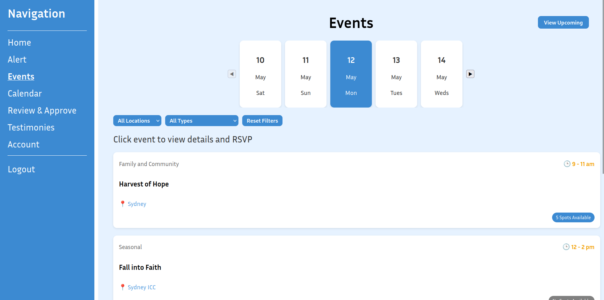
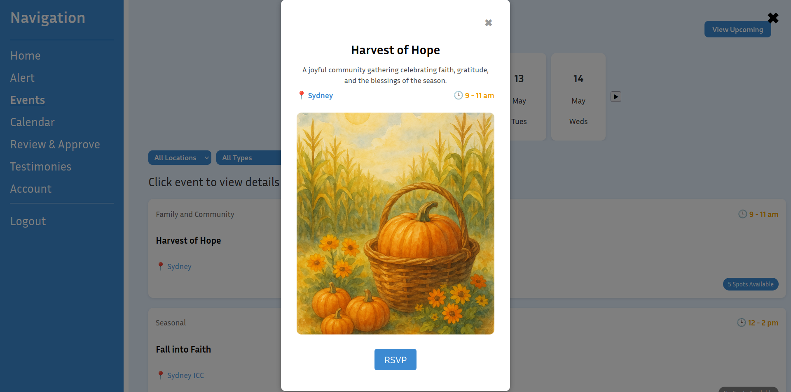
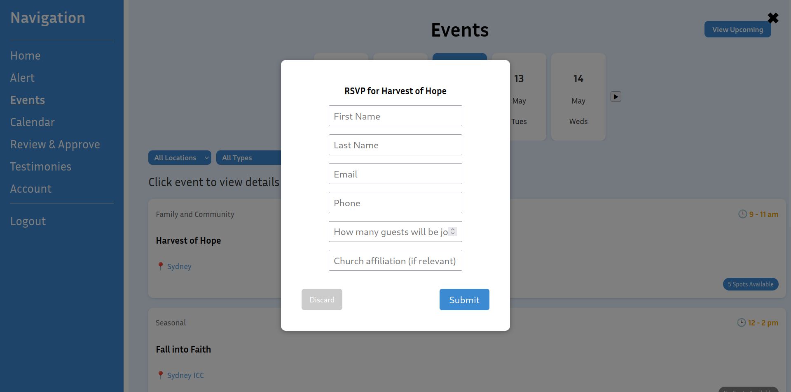
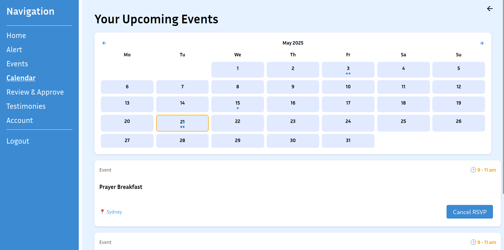
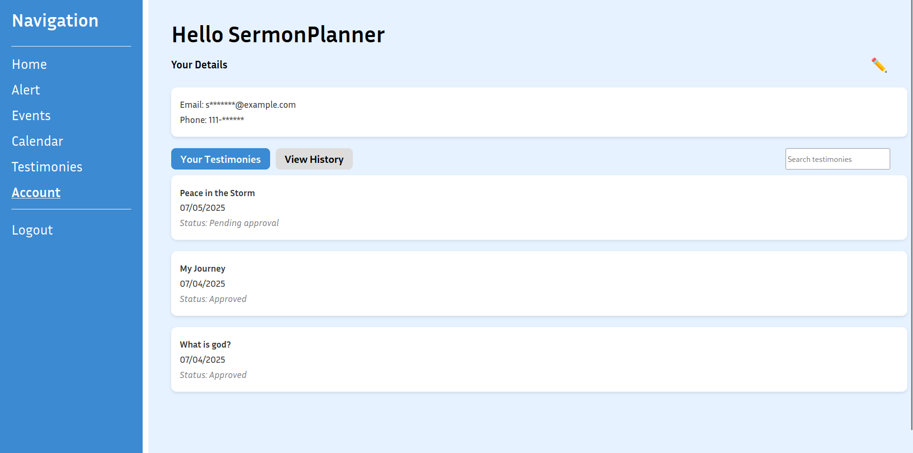
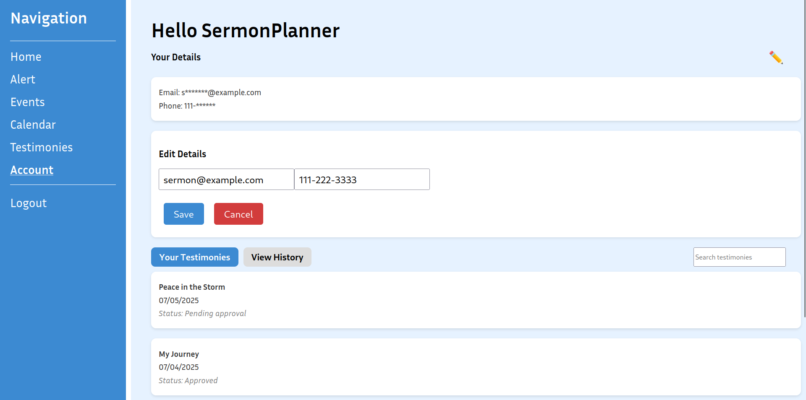

## Requirements

Version used: 
- npm: 10.9.2

Packages installed: 
- [React Router DOM](https://reactrouter.com/en/main)

## Running Project 

How to run file/Setup: 
1. Clone or download the repository.
2. Open terminal and navigate to the project root folder.
3. Install dependencies: `npm install`
4. Build the project: `npm run build`
5. Start the server: `npm start`

## Home 

## Login 
Login credentials: 
| Username             | Password      |
| -------------------- | ------------- |
| User                 | pass          |
| SermonPlanner        | pass          |
| Moderator            | pass          |
| EmergencyCoordinator | pass          |

## Sign Up 

## Alert

## Events 
The events page is accessible for all users 

Users can scroll through dates and apply filters by location and event type.

Clicking an event opens a detail popup with time, location, description, and RSVP options.

Users can RSVP by entering their details in the popup form.

When clicking "View Upcoming", a calendar will show. This is also accessible from the navigation sidebar. The calendar highlights registered events using visual indicators below the dates.

The "Add Events" button is only accessible for the sermon planner. 

## Review and Approve

## Testimonies

## Account
All users are able to access their account details. They are able to search through their posted testimonies and their history. 

When clicking on the edit button (the pencil) users are able to modify their details.

