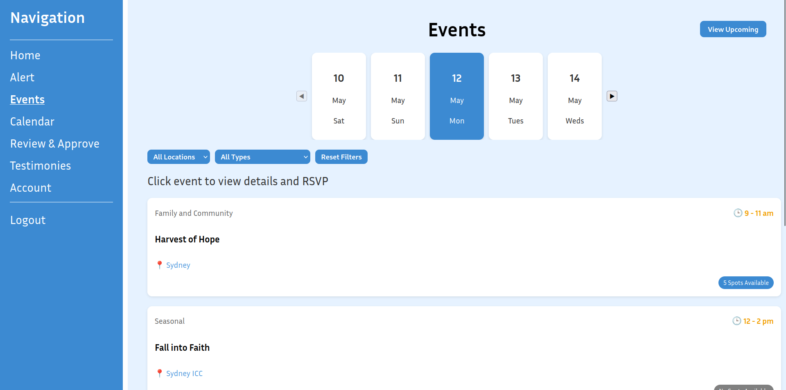
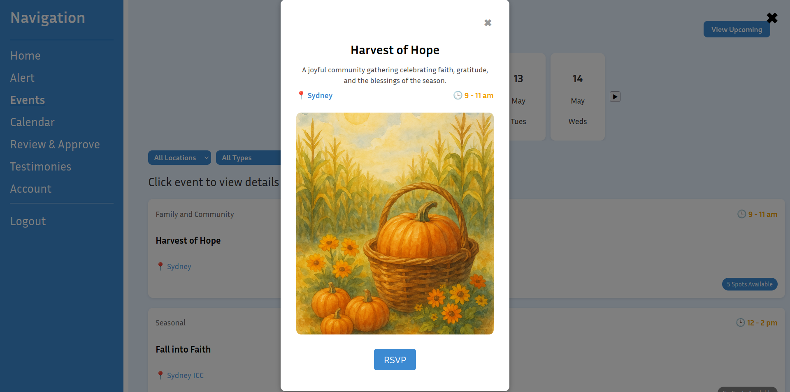
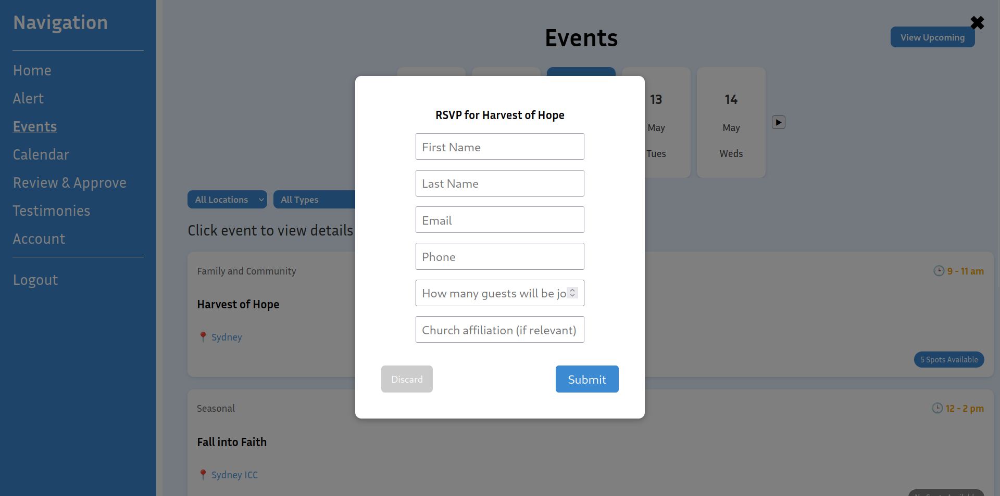
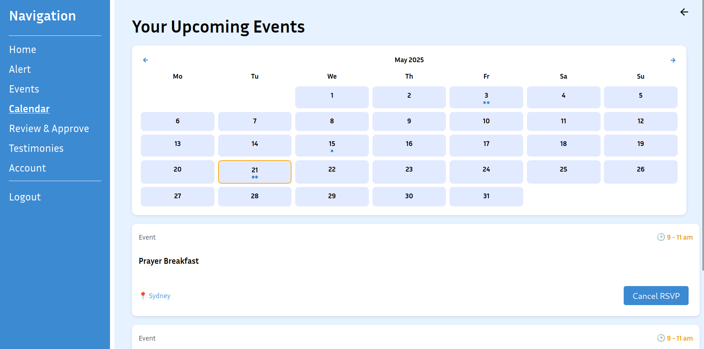
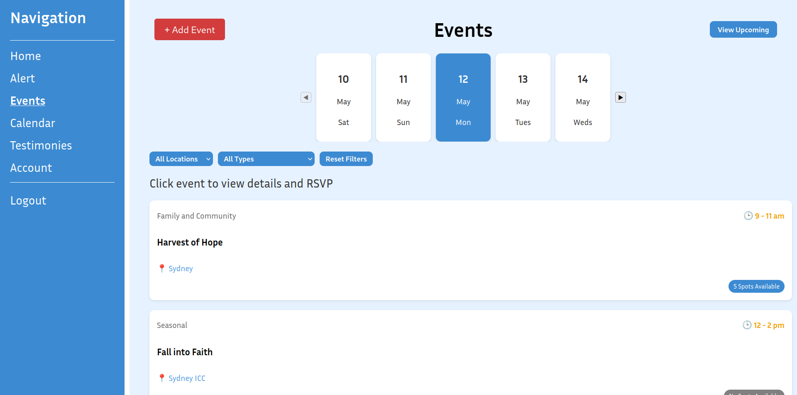
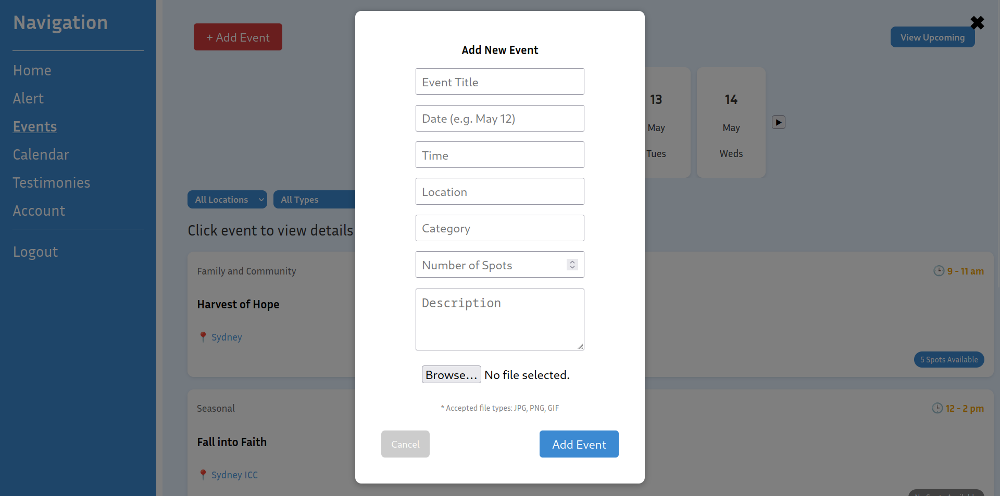
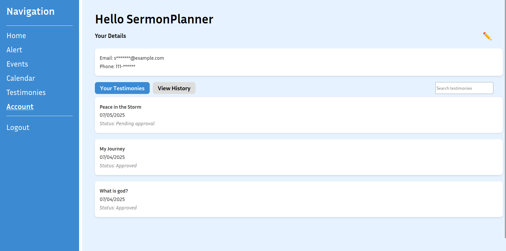
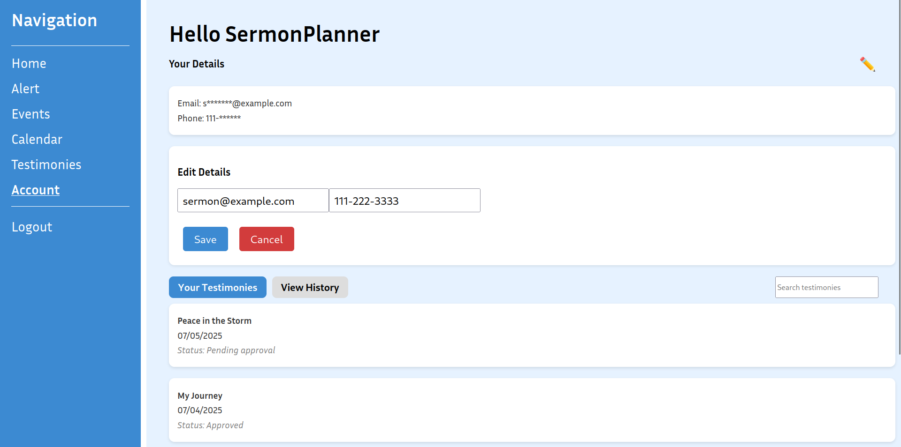

## Requirements

Version used: 
- npm: 10.9.2

Packages installed: 
- [React Router DOM](https://reactrouter.com/en/main)

## Running Project 

How to run file/Setup: 
1. Clone or download the repository.
2. Open terminal and navigate to the project root folder.
3. Install dependencies: `npm install`
4. Build the project: `npm run build`
5. Start the server: `npm start`

## Home 

The home page displays different content based on user roles. Users can access quick action cards to navigate to events, testimonies, calendar, and account.  For different roles of users,(eg: Sermon Planner) We had it's own add event section. Moderators see a special dashboard for reviewing testimonies.

*User home page with action cards*

*Sermon Planner with additioanl feature*

*Moderator home page with review dashboard*

## Login 

The login page features username/password authentication with password visibility toggle. Users can sign in with their credentials or use test buttons for quick access during development.

Login credentials: 
| Username             | Password      |
| -------------------- | ------------- |
| User                 | pass          |
| SermonPlanner        | pass          |
| Moderator            | pass          |
| EmergencyCoordinator | pass          |

*Login page with authentication form and test buttons*

*Implementation of hidden/visible password for better user security*

## Sign Up 
The registration page allows new users to create accounts with form validation. Users enter username, email, password, and password confirmation. Includes biblical quote and password visibility toggles.

*Sign up page with registration form and validation*

## Alert
Alert page is a page where emergency prayer meeting is scheduled or updates for the website will be shown

## Events 
The events page is accessible for all users 

Users can scroll through dates and apply filters by location and event type.

Clicking an event opens a detail popup with time, location, description, and RSVP options.

Users can RSVP by entering their details in the popup form.

When clicking "View Upcoming", a calendar will show. This is also accessible from the navigation sidebar. The calendar highlights registered events using visual indicators below the dates.

The "Add Events" button is only accessible for the sermon planner. 

## Review and Approve

## Testimonies
Testimonies pages are accessible to all users.

Where users can see everyone testimonies on this page.

If you want to see your own testimonies, click "View your posts", where you have the option to delete your testimonies. Which gives you a popup to delete.

If you like add your testimony, click on "Add Testimony", (Option to add few supported files) You have to compulsory add your title and description to post (should be approved by the moderator)

## Account
All users are able to access their account details. They are able to search through their posted testimonies and their history. 

When clicking on the edit button (the pencil) users are able to modify their details.

